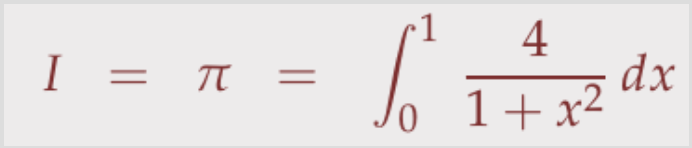
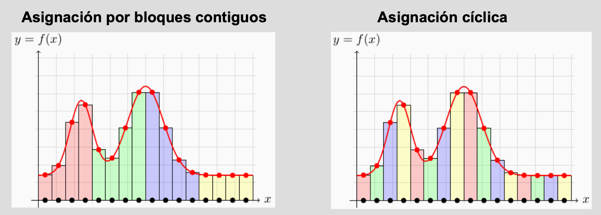
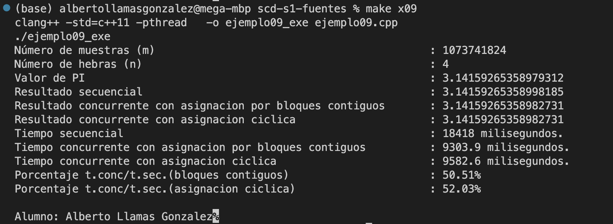
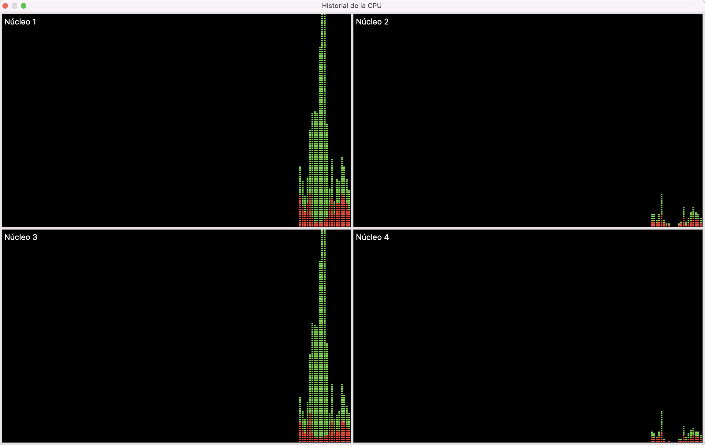

# Seminario 1 - Implementación concurrente del cálculo de Pi y medición de tiempos

> Alumno: Alberto Llamas González, Sistemas Concurrentes y Distribuidos 2022-2023

## Descripción del problema
El principal objetivo de la actividad es ver cómo la programación concurrente nos permite acelerar la resolución de algoritmos numéricos, entre otros problemas. En este caso, vamos a aproximar PI mediante el cálculo de la integral I de una función f de variable real. Para ello, evaluamos la función f en un conjunto de m puntos uniformemente espaciados entre [0,1] y aproximamos I como la media de todos esos valores, donde f es 4 / (1+x*x). Dando lugar a la siguiente integral:
 


## Código proporcionado
En la plantilla se nos proporciona el cálculo secuencial de PI:
```c++
double f( double x )
{
  return 4.0/(1.0+x*x) ;
}

double calcular_integral_secuencial(  )
{
   double suma = 0.0 ;                        // inicializar suma
   for( long j = 0 ; j < m ; j++ )            // para cada $j$ entre $0$ y $m-1$:
   {  const double xj = double(j+0.5)/m ;     //      calcular $x_j$
      suma += f( xj );                        //      añadir $f(x_j)$ a la suma actual
   }
   return suma/m ;                            // devolver valor promedio de $f$
}
```

También se nos proporciona cómo realizar la medición de tiempos, es decir, la duración del cálculo tanto concurrente como secuencial y el porcentaje de tiempo concurrente respecto del secuencial:

```c++
time_point<steady_clock> inicio_sec  = steady_clock::now() ;
  const double             result_sec  = calcular_integral_secuencial(  );
  time_point<steady_clock> fin_sec     = steady_clock::now() ;
  double x = sin(0.4567);
  time_point<steady_clock> inicio_conc = steady_clock::now() ;
  const double             result_conc = calcular_integral_concurrente(  );
  time_point<steady_clock> fin_conc    = steady_clock::now() ;
  duration<float,milli>    tiempo_sec  = fin_sec  - inicio_sec ,
                           tiempo_conc = fin_conc - inicio_conc ;
  const float              porc        = 100.0*tiempo_conc.count()/tiempo_sec.count() ;
```


## Cálculo concurrente
Para el cálculo concurrente se han realizado ambos métodos propuestos, la asignación por bloques contiguos y la asignación cíclica. Expliquemos ambos. En ambos casos, la hebra principal recoge las sumas parciales y calcula la suma total.



Sea **m** el número de subintervalos y **n** el numero de hebras, en la asignación por bloques contiguos debemos dividir m/n y redondear hacia arriba asignando a cada hebra el número de bloques resultante.

En la asignación cíclica se va asignando, como su nombre índica, cíclicamente, cada hebra a cada intervalo tal y como se aprecia en la figura superior.

## Resultados y medición de tiempos

Como era de esperar el resultado de calcular PI concurrentemente, nos ofrece una aproximación más exacta a su valor y en un menor tiempo. Sin embargo, podemos observar que no hay prácticamente diferencia en calcular PI de forma concurrente utilizando el método de asignación por bloques contiguos o el de asignación cíclica.



En mi caso utilizo un MacBook Pro y, tras investigar un poco no he encontrado forma de monitorizar correctamente el la carga del procesador que consume cada hebra. Si miramos los nucleos del ordenador podemos razonar un poco el sentido al ver que el primero (hebra principal) es el que más consume:




